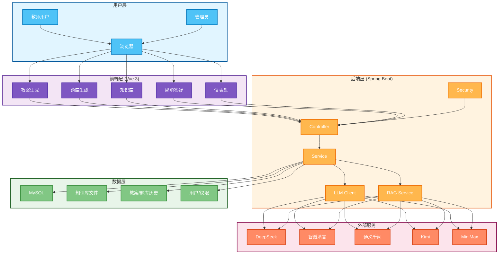
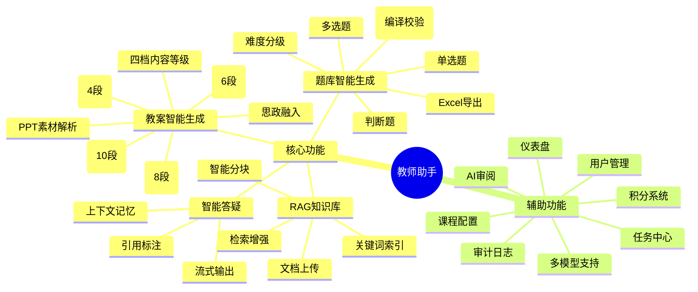
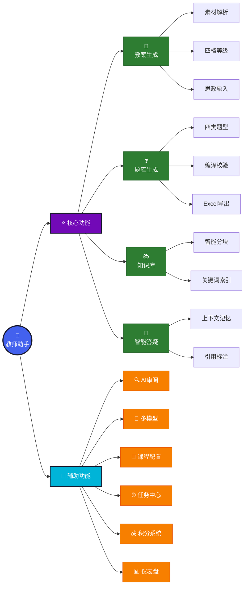
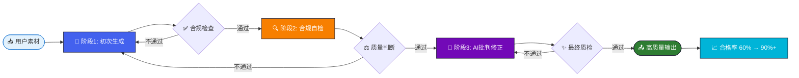
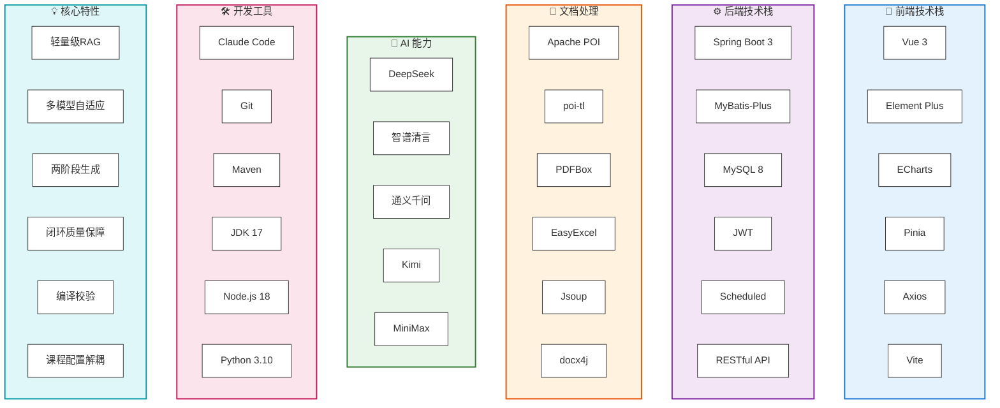
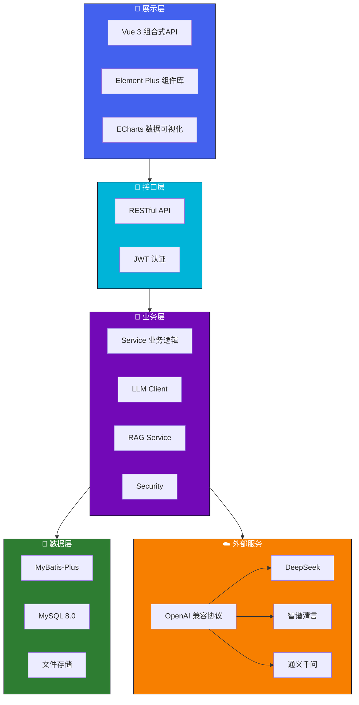
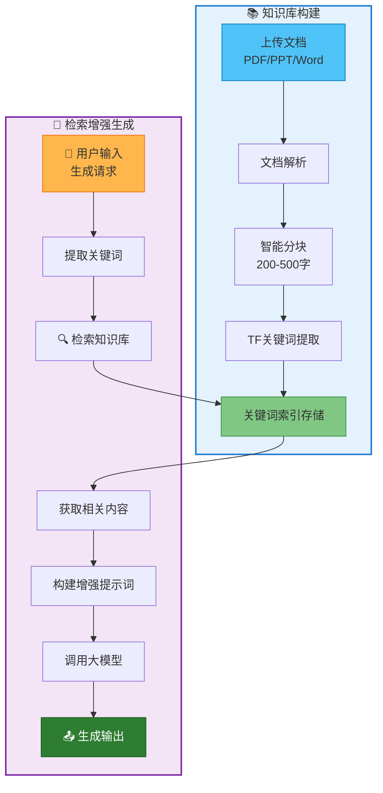
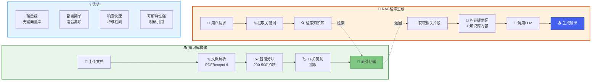

# 比赛材料 Mermaid 图表代码

本文件包含所有比赛材料所需的Mermaid图表代码。
可以复制到以下平台使用：
- https://mermaid.live/ (在线编辑器，可导出PNG/SVG)
- https://app.diagrams.net/ (draw.io，支持Mermaid)
- https://www.processon.com/ (ProcessOn，支持部分Mermaid)
- Typora / VS Code + Mermaid插件

---

## 1. 系统架构图

### Mermaid代码



### ProcessOn / draw.io 布局建议

```
┌─────────────────────────────────────────────────────────────────┐
│                         用户层                                   │
│  ┌──────┐    ┌──────┐    ┌──────┐                             │
│  │教师用户│    │管理员│    │浏览器│                             │
│  └──────┘    └──────┘    └──────┘                             │
└─────────────────────────────────────────────────────────────────┘
                                │
                                ▼
┌─────────────────────────────────────────────────────────────────┐
│                     前端层 (Vue 3)                               │
│  ┌──────┐  ┌──────┐  ┌──────┐  ┌──────┐  ┌──────┐             │
│  │教案生成│  │题库生成│  │知识库│  │智能答疑│  │仪表盘│             │
│  └──────┘  └──────┘  └──────┘  └──────┘  └──────┘             │
└─────────────────────────────────────────────────────────────────┘
                                │
                                ▼
┌─────────────────────────────────────────────────────────────────┐
│                   后端层 (Spring Boot)                           │
│  ┌──────┐  ┌──────┐  ┌──────┐  ┌──────┐  ┌──────┐             │
│  │Controller│ │Service│ │LLM Client│ │RAG Service│ │Security│     │
│  └──────┘  └──────┘  └──────┘  └──────┘  └──────┘             │
└─────────────────────────────────────────────────────────────────┘
                    │                           │
                    ▼                           ▼
┌─────────────────────────────┐   ┌───────────────────────────────┐
│          数据层              │   │      外部服务                 │
│  ┌────┐ ┌────┐ ┌────┐ ┌────┐│   │┌────┐┌────┐┌────┐┌────┐┌────┐│
│  │MySQL││文件││历史││用户││   │ ││DeepSeek││智谱││千问││Kimi││MiniMax││
│  └────┘ └────┘ └────┘ └────┘│   │└────┘└────┘└────┘└────┘└────┘│
└─────────────────────────────┘   └───────────────────────────────┘
```

---

## 2. 功能模块图

### Mermaid代码



### graph版本（更适合导出）



---

## 3. 质量保障流程图

### Mermaid代码

```mermaid
flowchart TD
    START(["开始"])

    PHASE1(("📋 阶段1<br/>初次生成"))
    P11["用户上传素材"]
    P12["构建提示词模板"]
    P13["调用国产大模型"]
    P14["生成初稿"]

    CHECK1{🔍 合规检查}
    PASS1["✅ 格式规范"]
    PASS2["✅ 思政要素"]
    PASS3["✅ 知识点完整"]

    PHASE2(("🔧 阶段2<br/>合规自检"))
    SELF1["AI检查格式规范"]
    SELF2["AI检查思政要素"]
    SELF3["AI检查知识点"]

    CHECK2{⚖️ 二次判断}
    PHASE3(("🎯 阶段3<br/>AI批判与修正")]
    CRITIC1["AI角色扮演"]
    CRITIC2["专业批判"]
    CRITIC3["修正重生成"]

    COMPILE["🔨 编译校验<br/>(题库专用)"]

    CHECK3{✨ 最终质检}
    OUTPUT(["📤 输出高质量资源"])

    FAIL["❌ 不通过"]

    START --> PHASE1
    PHASE1 --> P11 & P12 & P13 & P14
    P11 & P12 & P13 & P14 --> CHECK1

    CHECK1 -->|通过| PASS1 & PASS2 & PASS3 --> PHASE2
    CHECK1 -->|不通过| FAIL

    PHASE2 --> SELF1 & SELF2 & SELF3
    SELF1 & SELF2 & SELF3 --> CHECK2

    CHECK2 -->|通过| PHASE3
    CHECK2 -->|不通过| FAIL

    PHASE3 --> CRITIC1 & CRITIC2 & CRITIC3
    CRITIC1 & CRITIC2 & CRITIC3 --> CHECK3

    CHECK3 -->|通过| COMPILE
    CHECK3 -->|不通过| PHASE3

    COMPILE --> CHECK3
    FAIL --> PHASE1
    CHECK3 -->|最终通过| OUTPUT

    style START fill:#4361ee,stroke:#1a1a2e,stroke-width:2px,color:#fff
    style OUTPUT fill:#2e7d32,stroke:#1a1a2e,stroke-width:2px,color:#fff
    style FAIL fill:#e94560,stroke:#1a1a2e,stroke-width:2px,color:#fff

    style PHASE1 fill:#4361ee,stroke:#1a1a2e,stroke-width:2px,color:#fff
    style PHASE2 fill:#f77f00,stroke:#1a1a2e,stroke-width:2px,color:#fff
    style PHASE3 fill:#7209b7,stroke:#1a1a2e,stroke-width:2px,color:#fff

    classDef passStyle fill:#c8e6c9,stroke:#2e7d32,stroke-width:2px
    classDef failStyle fill:#ffcdd2,stroke:#c62828,stroke-width:2px

    class CHECK1,CHECK2,CHECK3 failStyle
    class PASS1,PASS2,PASS3 passStyle
```

### 简化版本



---

## 4. 技术栈图

### Mermaid代码



### 分层架构版本



---

## 5. RAG流程图

### Mermaid代码



### 详细版本



---

## 使用说明

### 方法1：在线Mermaid编辑器（推荐）

1. 访问 https://mermaid.live/
2. 复制上面的代码块
3. 粘贴到左侧编辑器
4. 右侧实时预览
5. 点击 "Download PNG" 或 "Download SVG" 下载

### 方法2：draw.io

1. 访问 https://app.diagrams.net/
2. 点击 "Arrange" -> "Insert" -> "Advanced" -> "Mermaid"
3. 粘贴Mermaid代码
4. 调整样式和布局
5. 导出为PNG/SVG

### 方法3：ProcessOn

1. 访问 https://www.processon.com/
2. 新建流程图
3. 在左侧工具栏找到 "Mermaid" 或使用图形库手动绘制
4. 参考上面的布局建议手动绘制

### 方法4：VS Code

1. 安装 "Markdown Preview Mermaid Support" 插件
2. 新建 .md 文件
3. 粘贴代码块
4. 预览并截图

### 方法5：Typora

1. 打开Typora
2. 新建文档
3. 粘贴代码块
4. 导出为PNG（需要安装主题支持）

---

## 样式调整建议

### 颜色方案

```css
/* 推荐配色 */
主色: #4361ee  /* 蓝色 */
辅色: #7209b7  /* 紫色 */
成功: #2e7d32  /* 绿色 */
警告: #f77f00  /* 橙色 */
危险: #e94560  /* 红色 */
信息: #00b4d8  /* 青色 */
深色: #1a1a2e  /* 深色背景 */
```

### 节点样式

```mermaid
%% 圆角矩形
style id fill:#颜色,stroke:#边框色,stroke-width:2px,color:#文字色

%% 圆形节点
id(("文字"))
style id fill:#颜色,stroke:#边框色,stroke-width:2px,color:#文字色

%% 菱形（判断）
id{条件}
style id fill:#颜色,stroke:#边框色,stroke-width:2px,color:#文字色
```

---

## 导出建议

1. **PNG格式**：适合Word文档，推荐分辨率 300 DPI
2. **SVG格式**：可缩放矢量，适合Web展示
3. **尺寸建议**：
   - 横向图：宽度 1920px 或 1280px
   - 纵向图：高度 1080px
4. **背景**：建议使用白色或透明背景
